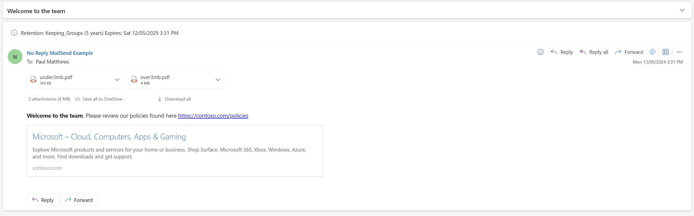

# app-send-mail-ps
Setup and code to send email using an App Registration and Microsoft Graph


# Set up
You are required to be a Global Administrator to run the scripts, logged into your Azure Tenant using Azure CLI
```powershell
az login
```

## App Registration
- Create Resource Group and Key Vault
- Create an App Registration in Azure AD with Self Signed Certificate
- Add the following API Permissions:
  - Microsoft Graph
    - Mail.Send
    - Mail.ReadWrite
- Grant Role Assignment to the App Registration

The following powershell script will create Resource Group with a Key Vault. It will also create the App Registration, give it permissions, create a certificate and store that with the App ID in the KeyVault. Lastly it will add the account that runs the script access to the Key Vault.

| Resource Type    | Name                | Description                          |
| ---------------- | ------------------- | ------------------------------------ |
| App Registration | [prefix]-app-[name] | App Registration for sending email   |
| Resource Group   | [prefix]-rg-[name]  | Resource Group to hold the Key vault |
| Key Vault        | [prefix]-kv-[name]  | Key Vault to store the certificate   |

Pass in parameters to customize the App
- Prefix
- Name
- Location

[create-app-reg.ps1](./src/create-app-reg.ps1)

```powershell
# Example
./src/create-app-reg.ps1 `
  -Prefix "cfcode" `
  -Name "mail-send" `
  -Location "uksouth"
```

## Create the Shared Mailbox, Security Enabled Group and Application Access Policy
Update the [email-setup.json file](./config/email-setup.json) and add your account (without domain) to the `owners` and `members` arrays of the `mailEnabledSecurityGroups`.

This json file will help you create the following:
- Shared Mailbox `no-reply.mailsend@[tenantdomain]`
  - The shared mailbox can be used without a license to send emails from.
  - Configured for automatic replies.
  - Hidden from Address lists.
- Mail Enabled Security Group `no-reply-mailsend-sg@[tenantdomain]`
  - This group will be used to grant the application to send emails. 
  - It is also used as a distribution group if you wish to send to all members of the group using the Mail Enabled Security Group SMTP `no-reply-mailsend-sg@[tenantdomain]`.
- Application Access Policy
  - This policy will grant the application the ability to send emails from anyone who is a member of the Mail Enabled Security Group.

Run the [setup-emailconfig.ps1](./src/setup-emailconfig.ps1) script to create the Shared Mailbox, Security Enabled Group and Application Access Policy. It will grab the App Registration AppID from the KeyVault.
```powershell
# Example
./src/setup-emailconfig.ps1 `
  -Prefix "cfcode" `
  -TenantDomain "contoso.com" `
  -Name "mail-send"
```

# Sending Email
To run the following script, you only need access to the KeyVault where the certificate is stored and clientID of the App Registration.

The [send-email.ps1](./src/send-email.ps1) script will send an email using the App Registration.

It will grab the App Registration AppID and Certificate details from the KeyVault, after creating the certificate in memory it will create a JWT token and use that to authenticate with Microsoft Graph. This will return a Bearer token that will be used to send the email.

Parameters for the script
| Parameter            | Type     | Description                                                                                                | Example                                       |
| -------------------- | -------- | ---------------------------------------------------------------------------------------------------------- | --------------------------------------------- |
| Prefix               | string   | Prefix used in the Resource Group, App Registration and Key Vault                                          | `cfcode`                                      |
| EmailTo              | string[] | Array of email address to send the email to, typically you would send this to the distribution group smtp. | `@("no-reply.mailsend-sg@contoso.com")`       |
| EmailSubject         | string   | Subject of the email                                                                                       | `Test Email`                                  |
| EmailBody            | string   | Body of the email                                                                                          | `<b>Hello World, This is a test email</b>`    |
| EmailBodyContentType | string   | Content Type of the email body (Text/HTML)                                                                 | `HTML`                                        |
| EmailFrom            | string   | Email address to send the email from, this should be your shared mailbox                                   | `no-reply.mailsend@contso.com`                |
| Name                 | string   | (Optional) Name used in the Resource Group, App Registration and Key Vault                                  | `mail-send`                                   |
| Attachments          | string   | (Optional) Array of file paths to attach to the email                                                      | `@("C:\temp\file1.txt", "C:\temp\file2.txt")` |


```powershell
./src/send-email.ps1 `
  -Prefix "cfcode" `
  -EmailTo @("no-reply.mailsend-sg@contoso.com") `
  -EmailSubject "Welcome to the team" `
  -EmailBody "<b>Welcome to the team</b>, Please review our policies found here https://contoso.com/policies" `
  -EmailBodyContentType "HTML" `
  -EmailFrom "no-reply.mailsend@contso.com" `
  -Attachments @( "..\files\under3mb.pdf", "..\files\over3mb.pdf")
```

The example uploads 2 different file size attachments, this is because there are 2 different ways of uploading attachments depending on the size of the file. If the file is under 3MB you can use the `fileAttachment` property in the email object. If the file is over 3MB you will need to use the `uploadSession` property in the email object.

